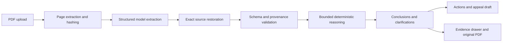

# ClaimBridge architecture

ClaimBridge is a local-first React and Flask application for evidence-backed analysis of synthetic medical claim packets. It separates probabilistic document understanding from deterministic validation and reasoning.

## Runtime boundaries

- The React client owns navigation, evidence selection, and unsaved draft text. It does not decide coverage or calculate claim facts.
- Flask routes validate transport input and delegate to application use cases.
- Application code coordinates ingestion, analysis jobs, clarification, revisions, and draft persistence.
- Domain code performs validation, money/date handling, conflict detection, bounded conclusions, actions, and draft rendering.
- Infrastructure code owns SQLite, PDF extraction, model calls, retrieval, and diagnostics.
- Model output provides structured facts and source references. It does not produce final conclusions or determine liability.
- Original PDFs, document hashes, analysis revisions, and evidence records are preserved for traceability.

## Data and safety model

Uploads and runtime state remain in ignored local SQLite storage. Provider credentials are backend-only and are never stored in repository files or exposed through `VITE_*` variables. Exact evidence text is restored from the uploaded PDF after model selection, then validated for document, page, and offset consistency.

Unknown, user-reported, derived, and conflicted facts remain distinct. Related claims are not automatically merged. New answers or documents advance the workspace revision and make prior output stale until regeneration. No endpoint submits an appeal.

Demo Mode accepts only the exact checked-in synthetic packet by PDF SHA-256. It revalidates retained provider extraction against the newly uploaded documents and runs the same deterministic reasoning path.

## Deliberate constraints

The application uses one local API process and a sequential background analysis worker. It has no OCR, authentication, hosted deployment, clinical reasoning, or automated submission. Those are explicit scope boundaries, not hidden capabilities.

See [api-contracts.md](api-contracts.md), [retrieval.md](retrieval.md), [safeguards.md](safeguards.md), and the current [workflow guide](../../docs/claim-workflow.md) for detail.
