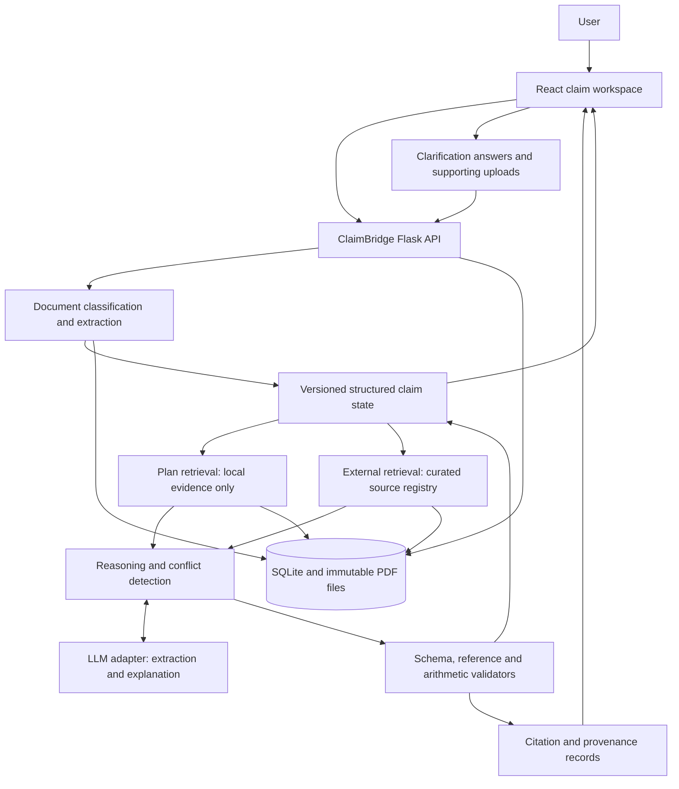

# Hackathon architecture

One React interface, one Python API process, SQLite and local files. Preparation artifacts are not a running application. Runtime must never retrieve golden analyses, expected JSON, or test answers.

**Boundaries:** user text and web documents are data, never instructions. The LLM cannot submit appeals, browse arbitrary URLs or edit claim source facts. Server code chooses source candidates, validates IDs and performs money/date math. A model's plan interpretation is labeled, linked and reviewable.

**Tables:** workspaces(id, revision, as_of); documents(id, workspace_id, hash, kind, status, path); pages(document_id, page, text, extraction_version); evidence(id, workspace_id, domain, location_json, text, hash); claim_revisions(workspace_id, revision, state_json); answers(id, question_id, revision, text); jobs(id, status, error); source_registry(id, metadata_json); action_plans(workspace_id, revision, json). FTS tables index local plan sections and external summaries separately. Artifact IDs are server-generated, not client paths.

Single sequential background worker is sufficient; SQLite-backed jobs with polling survive refresh. Do not add Celery, microservices, graph databases or orchestration frameworks for six documents. Production concurrency, identity and retention are separate work.

## Repository implementation layout

The user-approved scaffold now lives in ../../apps/. See [code structure](../../docs/code-structure.md) for module ownership and dependency direction. Only a static frontend shell and API liveness route exist; the pipeline above remains to implement. Canonical schemas remain in ../schemas/.
