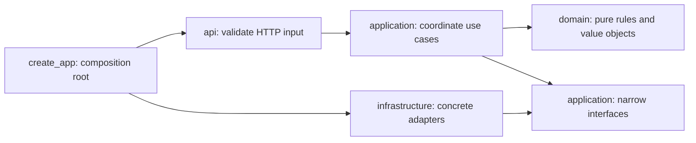

# Repository and code structure

## Scope and status

This is the agreed implementation layout plus a runnable foundation: a static React shell and a Flask liveness route. Claim ingestion, reasoning, retrieval, persistence, model calls and appeal workflows remain hackathon implementation work. Existing research and evaluation artifacts stay in place.

## Repository map

```text
Claimbridge/
├── apps/
│   ├── web/                          # React + TypeScript + Vite
│   │   ├── src/
│   │   │   ├── app/                  # Application composition and later navigation
│   │   │   ├── features/
│   │   │   │   ├── workspace/        # Overview, money summary, related claims
│   │   │   │   ├── documents/        # Upload, processing, document viewer
│   │   │   │   ├── evidence/         # Citations and source viewer
│   │   │   │   ├── clarifications/   # Questions, answers, revision changes
│   │   │   │   └── appeals/          # Strategy, actions, appeal draft
│   │   │   ├── components/ui/        # Shared presentational primitives
│   │   │   ├── lib/api/              # HTTP client and error boundary
│   │   │   ├── lib/contracts/        # Generated transport types (future)
│   │   │   ├── styles/               # Tokens and global styles
│   │   │   └── main.tsx
│   │   └── package.json
│   └── api/                          # Installable Python package
│       ├── src/claimbridge/
│       │   ├── __init__.py            # create_app composition root
│       │   ├── api/                  # Flask blueprints / HTTP boundary
│       │   ├── application/          # Use cases and narrow adapter interfaces
│       │   ├── domain/               # Pure facts/rules/validation/calculations
│       │   └── infrastructure/       # SQLite, PDF, LLM and retrieval adapters
│       ├── tests/                    # Backend tests
│       ├── pyproject.toml
│       └── requirements-dev.lock
├── contracts/                        # Canonical schema ownership / API guidance
├── docs/                             # Current code/contributor architecture
├── tests/e2e/                        # Full-workflow test location (future)
├── scripts/                          # Cross-project tooling (future)
├── claimbridge-prep/                 # Research, schemas, synthetic assets, oracles
├── .github/workflows/ci.yml
├── .env.example
├── package.json                      # npm workspace commands
├── package-lock.json
├── Makefile
└── README.md
```

Directories containing only README files deliberately reserve ownership; they are not implemented features. Runtime data goes in ignored `var/`, outside source and public assets.

## Backend boundaries



The composition root constructs dependencies. Domain code never imports Flask, PDF parsers, databases or LLM SDKs. Application use cases consume passed-in adapters; do not fetch global Flask state there. Infrastructure implements those interfaces without deciding insurance coverage. Routes translate validated requests into calls and map results/errors to HTTP. Avoid decorators, abstract base classes or generic repositories until actual repeated behavior justifies them.

### Planned backend modules, added when first implemented

| Location                    | Responsibility                                                 | Must not do                                                  |
| --------------------------- | -------------------------------------------------------------- | ------------------------------------------------------------ |
| api/workspaces.py           | Workspace creation and revision-aware reads                    | Mutate documents while serving GET                           |
| api/documents.py            | Upload validation and secure file responses                    | Accept arbitrary filesystem paths                            |
| api/analysis.py             | Start processing, answer questions, report jobs                | Put prompts or calculations in routes                        |
| api/appeals.py              | Action plans and draft export                                  | Send or submit appeals                                       |
| api/errors.py               | Consistent error envelope and status mapping                   | Leak raw document text or secrets                            |
| application/ingest.py       | Store original, schedule extraction, record outcome            | Guess missing fields                                         |
| application/analyze.py      | Normalize -> retrieve -> reason -> validate -> persist         | Import golden answers                                        |
| application/clarify.py      | Add answer evidence, increment revision, invalidate dependents | Rewrite original submitted claim fields                      |
| application/appeal.py       | Assemble strategy/arguments/draft from supported conclusions   | Assert success or invent a signature                         |
| application/ports.py        | Small Protocols for repository, extractor, model and retrieval | Become a generic plugin framework                            |
| domain/models.py            | Validated internal claim/evidence value objects                | Duplicate transport schema constraints by hand unnecessarily |
| domain/finance.py           | Integer-cent calculations and reconciliation                   | Treat unknown allowance as zero                              |
| domain/deadlines.py         | Rule/trigger-based date calculations                           | Guess receipt date from notice date                          |
| domain/conflicts.py         | Explicit competing-fact detection                              | Pick convenient evidence silently                            |
| domain/validation.py        | Reference integrity, relationships and semantic invariants     | Treat valid JSON as proof of factual correctness             |
| infrastructure/sqlite.py    | Connections, transactions and repository implementation        | Global connection shared across workers                      |
| infrastructure/files.py     | Hashed immutable artifacts, safe ID-to-path resolution         | Load arbitrary files from request paths                      |
| infrastructure/pdf.py       | Page text/table/geometry extraction                            | Hide OCR failure by returning invented text                  |
| infrastructure/retrieval.py | Separate plan/external FTS queries and scope filters           | Mix state-law background into governing plan rules           |
| infrastructure/llm.py       | Provider SDK, timeout, structured response boundary            | Calculate balances or submit external actions                |
| infrastructure/prompts/     | Versioned extraction/analysis/draft templates                  | Include known golden results                                 |
| infrastructure/migrations/  | Ordered SQL changes once persistence exists                    | Silently reset user workspaces                               |

Single process and one sequential worker are sufficient initially. Transactions persist new revisions and invalidate dependent analysis together; enforce expected_revision at the repository boundary to handle concurrent requests. Jobs are idempotent on workspace/revision/input hash. Original documents and source statements remain immutable. Add UTC timestamps; keep medical service dates as calendar dates without timezone conversion.

## Frontend organization

Organize by user feature. A feature may contain `components/`, `hooks/`, `api.ts`, `types.ts` and colocated `*.test.tsx`, but create only what is used. `app/` composes features. Features export a small public API from `index.ts` once implemented. Other features must not import internal components. Share primitives only when actual reuse appears; avoid a catch-all utils directory.

Server owns claim facts, revisions, calculations and conclusions. Client owns navigation, selected evidence, expanded panels and unsaved form text. Keep local component state until cross-component needs justify a store. Do not add Redux or a router for one workspace by default. The future API client treats JSON as unknown, validates it and exposes typed errors. Use request cancellation and explicit loading/error states. React text rendering is the default; untrusted content must not be injected as HTML.

### Appeal reasoning is a first-class view

`features/appeals/` renders **Why this approach?** using the validated argument's evidence and limitations:

1. Stated denial reason and cited source.
2. Contrary or missing facts and their support.
3. Applicable plan provision and scoped external rule.
4. Requested remedy and why it addresses that denial.
5. Alternatives and unresolved conditions.

Do not label an approach 'best' without qualifying it as strongest supported by the current evidence. Support the location argument without pretending prior authorization guarantees payment. This is presentation of existing validated arguments, not a second browser-side reasoning engine. Before/after analysis and downloadable packets remain optional enhancements.

## Contracts and fixtures

**Single source of truth:** `claimbridge-prep/schemas/*.schema.json` remains canonical for now. Do not copy it into apps. Backend internal value objects may wrap validated DTOs, but do not independently evolve wire fields. Once generation is implemented, generated TypeScript files go in web/src/lib/contracts and CI checks regeneration produces no diff. OpenAPI transport envelopes will live under contracts; the prepared API spec guides the first implementation.

Keep these domains distinct:

| Data                                                   | Allowed readers                                   |
| ------------------------------------------------------ | ------------------------------------------------- |
| User PDFs, extracted text, claim state in var/         | Backend workspace services only                   |
| Explicitly selected verified external-source registry  | Backend scoped retrieval                          |
| Synthetic PDFs                                         | User-selected upload or explicitly labeled replay |
| golden-analysis.md, expected-*.json, golden-tests.json | Tests/evaluation; never live analyzer             |
| Browser public assets                                  | Non-sensitive static UI assets only               |

Never recursively ingest the preparation directory. Replay must be explicit and visibly labeled. Model keys stay backend-only; VITE-prefixed variables are public browser configuration. .env is ignored and not loaded automatically by this scaffold.

## Tests and tooling

Backend uses pytest and Ruff. Frontend uses strict TypeScript, ESLint and Prettier. Python uses a src layout and editable install; Node uses one npm workspace lockfile. CI runs checks without model credentials or networked insurance calls. Add domain unit tests for money/date/conflict behavior, integration tests for repositories/API boundaries, and one full-flow browser test once those features exist. Don't write tests merely to assert that placeholders render.

Lockfiles freeze the verified dependency resolution; manifests express supported ranges. Update manifests and locks in the same change and rerun checks. requirements-dev.lock captures this scaffold's development environment; produce a separate deployment lock/image only when deployment is actually introduced. Flask/Vite development servers are local development tools.

## Official references checked

- [Flask application factories](https://flask.palletsprojects.com/en/stable/patterns/appfactories/): separate app instances and composition.
- [Python Packaging Guide: src layout](https://packaging.python.org/en/latest/discussions/src-layout-vs-flat-layout/): explicit installation and import isolation.
- [Vite guide](https://vite.dev/guide/): frontend development/build tooling.
- [TypeScript strict](https://www.typescriptlang.org/tsconfig/strict.html): strict type checking.

These references inform the scaffold. Feature ownership and module choices are project decisions, not universal requirements.

## Scaffold verification

Local backend checks passed: two pytest smoke tests, Ruff lint and formatting. Frontend checks passed: ESLint, TypeScript, Vite production build and Prettier. These validate the foundation only; there are no claim-workflow tests or live model calls yet. GitHub CI is configured but has not run on a remote repository.

Dependency resolution deliberately keeps TypeScript 5.9 within the linter peer range. The npm lock captures the tested toolchain; do not bypass peer conflicts with force or legacy-peer-deps. The official [checkout](https://github.com/actions/checkout), [setup-node](https://github.com/actions/setup-node) and [setup-python](https://github.com/actions/setup-python) documentation informed the CI configuration.
